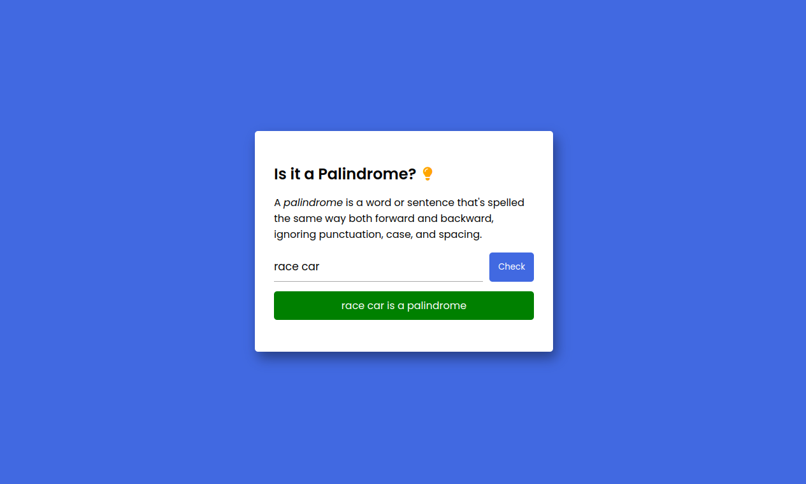

<h1 align='center'>Palindrome Checker</h1>

<h3 align='center'>
    <a href='https://panayiotistsg.github.io/palindrome-checker/'>Live Demo</a>
    |
    <a href='https://www.freecodecamp.org/learn/javascript-algorithms-and-data-structures-v8/build-a-palindrome-checker-project/build-a-palindrome-checker'>freeCodeCamp</a>
</h3>

## About

This project is part of the **freeCodeCamp Certification Projects**. It checks whether a given word is a palindrome.

## What is a Palindrome?

A *palindrome* is a word or phrase that can be read the same way forwards and backwards, ignoring punctuation, case, and spacing.

## Built with

- HTML5
- CSS
- JavaScript